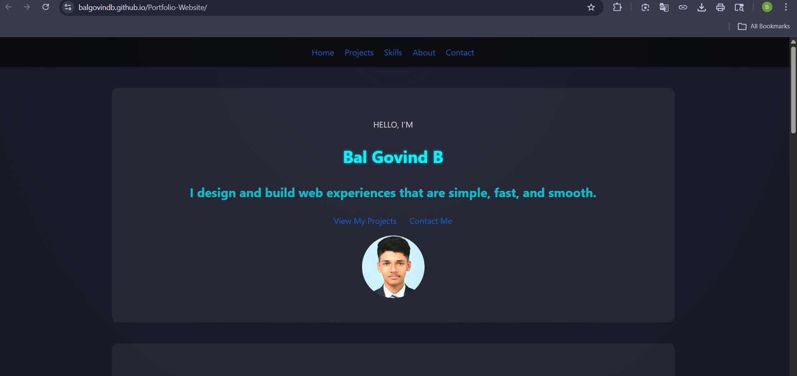

# 🌌 Bal Govind Portfolio Website

<p align="center">
  
</p>

<p align="center">
  <b>🚀 Modern • Responsive • Minimal • Clean UI</b>
</p>

---

## 🌐 Live Website

👉 **https://balgovindb.github.io/Portfolio-Website/**

---

## 🧠 About This Project

This is a **modern portfolio website** built using **HTML & CSS**, designed to showcase my skills, projects, and UI creativity.

It focuses on:

* Clean layout
* Smooth user experience
* Modern design aesthetics
* Responsive behavior across devices

---

## ✨ Features

* 🌙 Dark-themed modern UI
* ⚡ Smooth scrolling navigation
* 🧩 Project showcase cards
* 📱 Fully responsive design
* 📝 Functional contact form
* 🎯 Structured and clean layout

---

## 🧩 Sections

| Section     | Description                 |
| ----------- | --------------------------- |
| 🏠 Home     | Introduction + Hero section |
| 💼 Projects | Project showcase with links |
| 🧠 Skills   | Technical skills table      |
| 👤 About    | Short bio                   |
| 📬 Contact  | Form + social links         |

---

## 🛠️ Tech Stack

<p>
  
  
</p>

---

## 📂 Folder Structure

```
Portfolio-Website/
│── index.html
│── form.html
│── style.css
│── images/
│   ├── Profile.jpg
│   ├── Matrix.jpg
│   └── Triggered.jpeg
```

---

## 🎯 Learning Outcomes

Through this project, I learned:

* Structuring web pages using HTML
* Styling with CSS (layouts, colors, effects)
* Using Flexbox for layout design
* Creating responsive designs using media queries
* Implementing modern UI techniques

---

## 📸 Preview

<p align="center">
  
</p>

---

## 📬 Contact

📧 **Email:** [balgovindb2006@gmail.com](mailto:balgovindb2006@gmail.com)
🔗 **GitHub:** https://github.com/BalGovindB

---

## ⭐ Final Note

> This project was built as part of my **UID coursework** and reflects my understanding of modern web design principles.

---

<p align="center">
  💡 Always learning. Always building.
</p>
